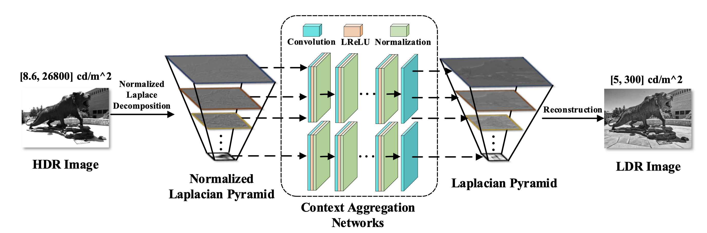

# Perceptually Optimized Tone Mapping of High-Dynamic-Range Images


## Introduction
This repository contains reference code for the paper [Perceptually Optimized Tone Mapping of High-Dynamic-Range Images](#),
Chenyang Le, Jiebin Yan, [Kede Ma](https://kedema.org/), [Yuming Fang](http://sim.jxufe.cn/JDMKL/ymfang.html).

We propose a perceptually optimized tone mapping method for high-dynamic-range (HDR) images based on deep neural networks (DNNs). We first decompose an input HDR image into a normalized Laplacian pyramid, and use two DNNs to estimate the Laplacian pyramid of the desired tone-mapped image. We end-to-end optimize our method over a database of HDR images by minimizing the normalized Laplacian pyramid distance, which is perceptually calibrated against human judgments. Across an independent set of HDR images, we find that our method produces images of consistently better visual quality compared to existing tone mapping algorithms, and runs much faster. In addition, we demonstrate the promise of the proposed method in image enhancement. 


## Prerequisites
The release version of TMO_CAN was implemented and has been tested on Ubuntu 16.04 with
- Python = 3.5.2
- PyTorch >= 0.4.1
- torchvision >= 0.2.1 


## Dataset
We do not have the right to distribute the large-scale dataset used for training and testing. Please kindly refer to the respective authors acknowledged in the manuscript.

## Train
We recommend to use **GPU**:
```
python Main.py --train True --use_cuda True
```

## Test
**GPU**:
```
python Main.py --train False --use_cuda True --ckpt TMO_CAN_release.pt
``` 
on **CPU-mode**:
```
python Main.py --train False --use_cuda False --ckpt TMO_CAN_release.pt
``` 


## Citation

To Do

